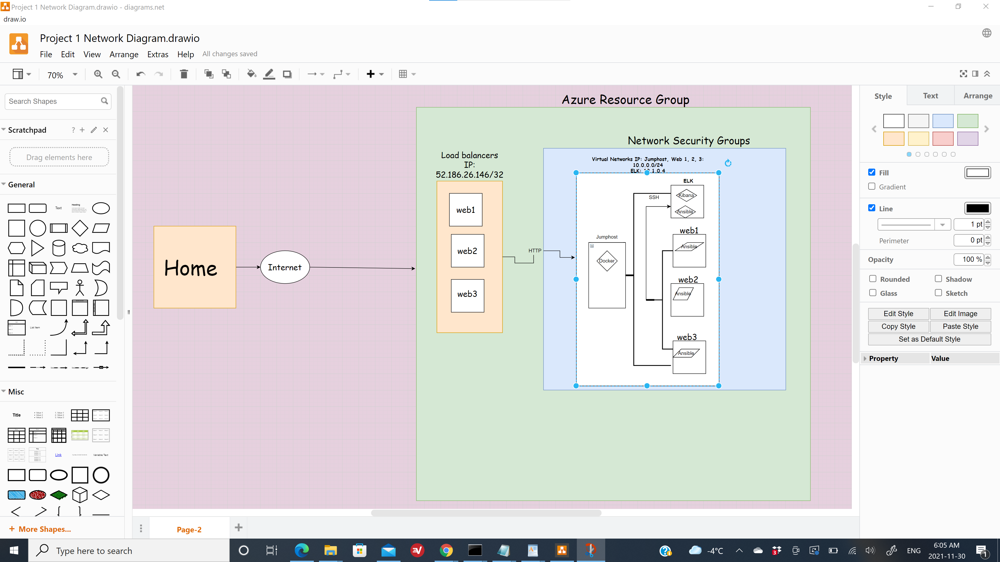

# Bootcamp-Project-1
Cloud Security Work
# Boot-Camp-Project-1
Cloud Security Work
## Automated ELK Stack Deployment

The files in this repository were used to configure the network depicted below.

-

These files have been tested and used to generate a live ELK deployment on Azure. They can be used to either recreate the entire deployment pictured above. Alternatively, select portions of the playbook.yml file may be used to install only certain pieces of it, such as Filebeat.

  - Enter the playbook file.  Filebeat-playbook.yml
  - And the config file:      filebeat-config.yml

This document contains the following details:
- Description of the Topology
- Access Policies
- ELK Configuration
  - Beats in Use
  - Machines Being Monitored
- How to Use the Ansible Build

### Description of the Topology

The main purpose of this network is to expose a load-balanced and monitored instance of DVWA, the D*mn Vulnerable Web Application.

Load balancing ensures that the application will be highly balanced (better distributed across several servers) and networks well destributed across several servers, in addition to restricting traffic to the network.
- What aspect of security do load balancers protect? Load balancers defend against distributed denial-of-servcice (DDoS) attacks.
- What is the advantage of a jump box? A jump box is a system on a network used to access and manage devices in a separate security zone. Alld admins first connect to a jump box before launching any administrative task or servers. Jump box prevents all the virtual machines from being exposed to the public internet.

Integrating an ELK server allows users to easily monitor the vulnerable VMs for changes to the data and system logs.
- What does Filebeat watch for? Filebeats watches/monitors, forwards and centralizes system log files and data. It also helps in observing for real-time detections of important log data.
- What does Metricbeat record? Metricbeat takes the metrics and statistics that it collects and ships them to the output that you specify; such as Elasticsearch or Logstash. Metribeats helps you monitor your servers by collecting metrics from the system and services running on the server, such as: Apache.

The configuration details of each machine may be found below.

|  Name      |   Function                   | IP Address | Operating System |
|------------|------------------------------|------------|------------------|
| Jump Box   | Gateway, Ansible Provisioner | 10.0.0.4   | Linux (Ubuntu)   |
|  Web1      | Web Server, DVWA Container   | 10.0.0.5   | Linux (Ubuntu)   |
|  Web2      | Web Server, DVWA Container   | 10.0.0.6   | Linux (Ubuntu)   |
|  Web3      | Web Server, DVWA Container   | 10.0.0.7   | Linux (Ubuntu)   |
| ELK-Server | ELK Container, Monitoring    | 10.1.0.4   | Linux (Ubuntu)   |

### Access Policies

The machines on the internal network are not exposed to the public Internet. 

Only the jump host machine can accept connections from the Internet. Access to this machine is only allowed from the following IP addresses:
- whitelisted IP addresses: 99.227.142.27 (my home public IP address).

Machines within the network can only be accessed by the Jump host machine.
- Which machine did you allow to access your ELK VM? Jumphost machine 
- What was its IP address? 20.120.109.77

A summary of the access policies in place can be found in the table below.

| Name       | Publicly Accessible | Allowed IP Addresses |
|------------|---------------------|----------------------|
| Jump Box   |  Yes                | 99.227.142.27        |
| Web1       |  No                 | 20.120.109.77        |
| Web2       |  No                 | 20.120.109.77        |
| Web3       |  No                 | 20.120.109.77        |

### Elk Configuration

Ansible was used to automate configuration of the ELK machine. No configuration was performed manually, which is advantageous because...
- What is the main advantage of automating configuration with Ansible? Ansible automation helps with the representation of Infrastructure as Code (IAC). Automation simplifies complex tasks, not just making developers' jobs more manageable but allowing them focus attention on other tasks that are more challenging.

The playbook implements the following tasks:
- In 3-5 bullets, explain the steps of the ELK installation play. E.g., install Docker; download image; etc._
- Install Docker and Ansible on the Jump Box machine. This enables playbook to push software services to the other machines.
- Install DVWA in the container.
- Set the playbook to automatic configuration. 
- Add the ELK machine to the hosts file with separate group header of ELK.
- Run the playbook file via ansible-playbook command.

The following screenshot displays the result of running `docker ps` after successfully configuring the ELK instance.

### Target Machines & Beats
This ELK server is configured to monitor the following machines:
- _TODO: List the IP addresses of the machines you are monitoring_

We have installed the following Beats on these machines:
- Filebeat

These Beats allow us to collect the following information from each machine:
- _TODO: In 1-2 sentences, explain what kind of data each beat collects, and provide 1 example of what you expect to see. E.g., `Winlogbeat` collects Windows logs, which we use to track user logon events, etc._

### Using the Playbook
In order to use the playbook, you will need to have an Ansible control node already configured. Assuming you have such a control node provisioned: 

SSH into the control node and follow the steps below:
- Copy the _____ file to _____.
- Update the _____ file to include...
- Run the playbook, and navigate to ____ to check that the installation worked as expected.

_TODO: Answer the following questions to fill in the blanks:_
- _Which file is the playbook? Where do you copy it?_
- _Which file do you update to make Ansible run the playbook on a specific machine? How do I specify which machine to install the ELK server on versus which to install Filebeat on?_
- _Which URL do you navigate to in order to check that the ELK server is running?

_As a **Bonus**, provide the specific commands the user will need to run to download the playbook, update the files, etc._
- ansible-playbook filebeat-playbook.yml
